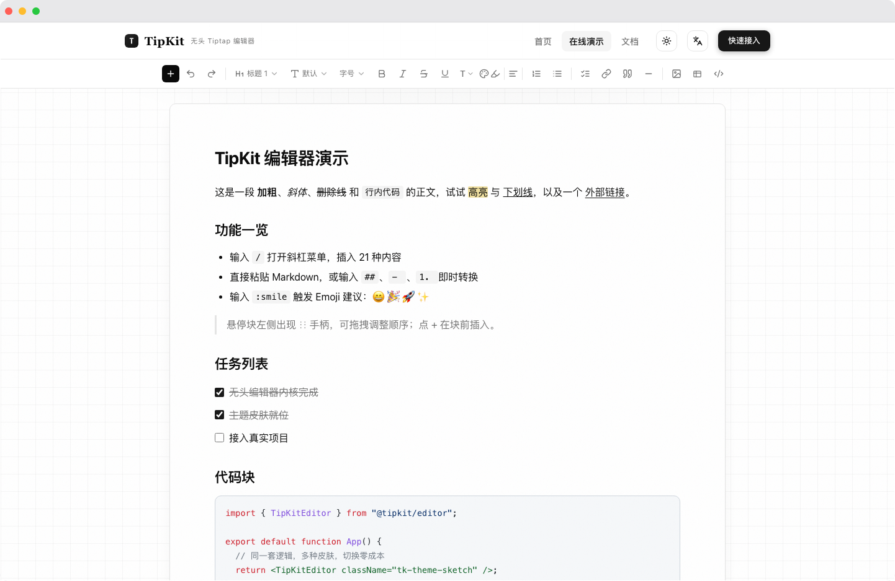

<div align="center">


# TipKit

**一套逻辑，任意风格**

基于 **Tiptap v3 + shadcn/ui + React 19** 的无头富文本编辑器套件。
编辑器逻辑与视觉彻底解耦：同一份代码，换一个主题 CSS 就是另一种风格。

`Tiptap v3` · `React 19` · `TypeScript strict` · `Tailwind v4` · `pnpm + turbo`

</div>

---

[](https://tipkit-delta.vercel.app/demo)

<p align="center"><a href="https://tipkit-delta.vercel.app/demo">👉 点击体验在线演示</a></p>

## 特性

| 能力 | 说明 |
| --- | --- |
| **无头架构** | `core` / `extensions` 零视觉样式，只描述行为；视觉全部收敛在主题层 |
| **主题系统** | 内置 `default`（shadcn 标准）、`sketch`（手绘线框）、`dark`（暗色）三种皮肤，自定义只需覆盖 CSS 变量 |
| **依赖注入** | 图片 / 附件上传、KaTeX 渲染由消费方通过 `EditorDeps` 注入，内核零外部服务依赖 |
| **Markdown 即时转换** | 粘贴 Markdown、输入 `#` `- ` `` ` `` 即时转节点；IME 组合输入兜底转换（链接、行内代码） |
| **斜杠菜单** | `/` 唤起可搜索分组面板，21 种内容节点开箱即用 |
| **高级节点** | 表格、KaTeX、分栏、折叠块、目录、附件、图片块、代码块高亮 |
| **SSR 安全** | 默认 `immediatelyRender: false`，App Router 直接可用 |

## 快速开始

```bash
pnpm add @tipkit/editor @tipkit/extensions @tipkit/ui @tipkit/components @tipkit/themes
```

```tsx
import { TipKitEditor } from "@tipkit/editor";
import { createBasicExtensions, createAdvancedExtensions } from "@tipkit/extensions";
import "@tipkit/themes/default.css";

const deps = { uploadImage: (file: File) => uploadToYourServer(file) };

export default function App() {
  return (
    <TipKitEditor
      deps={deps}
      className="tk-theme-default"
      placeholder="输入 / 打开斜杠菜单…"
      extensions={[...createBasicExtensions(), ...createAdvancedExtensions()]}
      onChange={(editor) => save(editor.getHTML())}
    />
  );
}
```

> 主题视觉样式作用域在 `tk-theme-*` 类下——**只 import CSS 不会生效**，必须把该类加到编辑器或其祖先元素（通常是包裹 div 或 `<html>`）。

换肤只需换 import，并同步把 `tk-theme-*` 类改成对应主题：

```ts
import "@tipkit/themes/default.css"; // shadcn 标准 → tk-theme-default
import "@tipkit/themes/sketch.css";  // 手绘线框   → tk-theme-sketch
import "@tipkit/themes/dark.css";    // 暗色       → tk-theme-dark
```

完整接入文档见 [apps/demo 官网](apps/demo) —— 首页、MDX 文档、在线演示、三种主题实时切换。

## Monorepo 结构

```
apps/demo/           # Next.js 官网 + 演示 + MDX 接入文档（纯静态导出）
packages/core/       # 无头核心：useTipKitEditor、序列化、EditorDeps、共享类型
packages/extensions/ # 全部 Tiptap 扩展（斜杠菜单、表格、KaTeX、分栏…）
packages/ui/         # 交互原语（浮层定位、键盘导航、激活态），仅布局
packages/components/ # shadcn 基础组件（颜色走 CSS 变量）
packages/themes/     # 主题皮肤：base / default / sketch / dark
packages/editor/     # 聚合入口 <TipKitEditor>
```

依赖方向单向：`editor → { core, extensions, ui }`，`extensions/ui → core`。

## 开发

```bash
pnpm install                   # 安装依赖
pnpm dev                       # 启动 demo（http://localhost:4000）
pnpm --filter @tipkit/demo dev # 只启动 demo
pnpm type-check                # 全仓类型检查
pnpm test                      # 全仓测试
pnpm build                     # 全仓构建（demo 输出纯静态 out/）
```

## 文档

- [接入文档（官网）](apps/demo/src/app/docs)
- [PRD（需求）](docs/PRD.md)
- [架构设计](docs/ARCHITECTURE.md)
- [技术设计](docs/TECHNICAL-DESIGN.md)

## License

MIT
