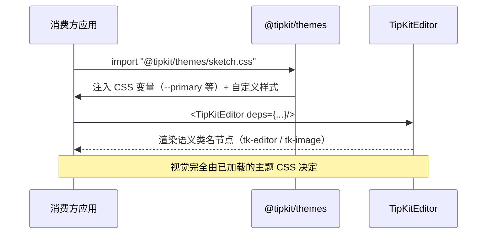
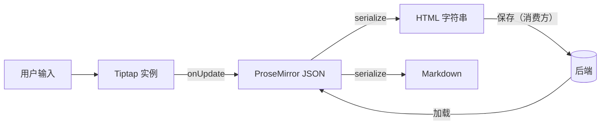

# TipKit 架构设计

> 版本：v0.3（功能对齐阶段：AI 生成、脚注、查找替换、语法检查、视频、Emoji、UniqueID、评论等已落地）

## 1. 设计原则

1. **无头（Headless）**：core/extensions 零视觉样式，只描述行为与数据结构
2. **风格后置**：一切视觉（颜色/字体/边框/背景）属于主题层（themes）
3. **依赖注入**：上传、存储、Katex 渲染等项目特定能力从 `EditorDeps` 注入
4. **模块自包含**：扩展目录内部相对导入，可按需裁剪
5. **源码共享**：monorepo 内 workspace 包直接引用 TS 源码（main 指向 src/index.ts），不构建产物

## 2. 总体架构

```mermaid
flowchart TB
    subgraph Consumer[消费方项目]
        App[blog / devkb / 其他]
    end

    subgraph TipKit[tipkit monorepo]
        subgraph Theme[主题层 @tipkit/themes]
            Default[default.css]
            Sketch[sketch.css]
            Base[base.css 布局]
        end

        subgraph Editor[聚合入口 @tipkit/editor]
            TE[TipKitEditor 组件<br/>buildToolbarGroups]
        end

        subgraph Logic[逻辑层]
            Core[@tipkit/core<br/>useTipKitEditor / 序列化 / EditorDeps]
            Ext[@tipkit/extensions<br/>全部 Tiptap 扩展]
            UI[@tipkit/ui<br/>浮层定位 / 键盘导航 / 激活态]
        end

        Comp[@tipkit/components<br/>shadcn 组件]
    end

    App -->|"import 主题 CSS"| Theme
    App -->|"import TipKitEditor"| Editor
    Editor --> Logic
    UI --> Comp
    Ext --> Core
```

## 3. 分层职责

| 包 | 职责 | 允许的样式 | 依赖 |
|---|---|---|---|
| `@tipkit/core` | 编辑器 hook、序列化、依赖注入容器、共享类型 | **零样式** | tiptap v3 |
| `@tipkit/extensions` | 全部 Tiptap 扩展（斜杠菜单、katex、附件…） | 语义类名 `tk-*` + 少量可覆盖默认样式 | core |
| `@tipkit/ui` | 交互原语：浮层定位、键盘导航、激活态 | 仅布局（flex/gap/z-index） | core, components |
| `@tipkit/components` | shadcn 基础组件（button/popover/…） | CSS 变量驱动 | radix, cva |
| `@tipkit/themes` | 主题皮肤：CSS 变量 + 自定义 CSS | **一切视觉** | 无 |
| `@tipkit/editor` | 聚合入口：组装 core+extensions+ui | — | 全部 | 

### 3.1 扩展集组成

- **`createBasicExtensions()`**：StarterKit + 行内/块级 Markdown 输入规则 + 表格 + 字号/字体族/颜色/对齐/高亮 + 字数统计 + TableReadonlyResize（只读列宽）
- **`createAdvancedExtensions()`**：图片块、代码块（lowlight 高亮 + Mermaid 渲染）、KaTeX、Callout、分栏、折叠块、目录、iframe、附件、视频、块句柄、文件拖拽、状态标签
- **opt-in 扩展**（按需单独引入）：AI 生成（`AiGeneration`，UI 浮层 `AiMenu` 在 ui 包）、脚注、划词评论、画板 Canvas、查找替换、LanguageTool 语法检查、UniqueID、Emoji（完整库 + 短代码输入规则）

## 4. 主题机制



- 主题切换 = 加载不同 CSS 文件，**不改变任何组件代码**
- 自定义风格：复制一份主题 CSS 改变量（或仅覆盖 `--tk-*` 语义变量）
- sketch 手绘风格需要字体资源，由消费方引入（主题包不打包字体文件）

## 5. 依赖注入

```ts
interface EditorDeps {
  uploadImage?: (file: File, editor: Editor) => Promise<string>;
  uploadAttachment?: (file: File, editor: Editor) => Promise<AttachmentMeta>;
  renderKatex?: (tex: string, displayMode: boolean) => Promise<string>;
  ai?: AIProvider;                       // AI 流式文本生成（AiMenu 浮层与 AI 命令共用）
  t?: Translate;                         // i18n，缺省中文词典
  onCommentCreate?: (range: CommentRange) => void;   // 划词评论创建回调
  onCommentClick?: (commentId: string) => void;      // 评论标记点击回调
}
```

- 通过 `<EditorProvider deps={...}>` 提供，扩展内 `useEditorDeps()` 读取
- **禁止**扩展内部直接调用项目 API / 全局变量

## 6. 数据流



- 保存/加载格式由消费方决定（推荐存 JSON，渲染用 HTML）
- `@tiptap/markdown` v3 提供 Markdown 双向转换

## 7. 目录结构

```
tipkit/
├── apps/demo/                 # Next.js 演示（devkb / sketch 多主题页面）
├── packages/
│   ├── core/                  # 无头核心
│   ├── extensions/            # 扩展集（迁移自 blog rich-text）
│   ├── ui/                    # 无头 UI 原语
│   ├── components/            # shadcn 组件
│   ├── themes/                # 主题皮肤（devkb / sketch）
│   └── editor/                # 聚合入口
└── docs/                      # PRD / 架构 / 技术设计
```

## 8. 与现有项目的关系

| 来源 | 迁移内容 |
|---|---|
| blog `src/components/rich-text/` | 全部扩展（Tiptap v3 源码级复用）→ `extensions/`、`ui/` |
| devkb `@devkb/editor` | monorepo 工程经验、测试规范（vitest+happy-dom）→ 工程配置 |
| shadcn/ui 官方 | 基础组件 → `components/` |
